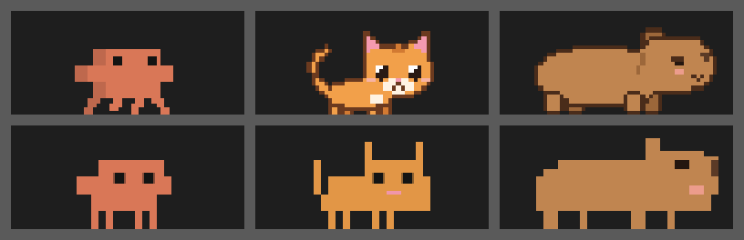
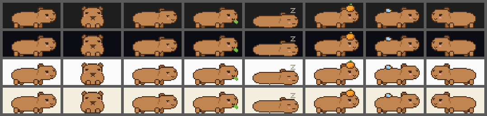
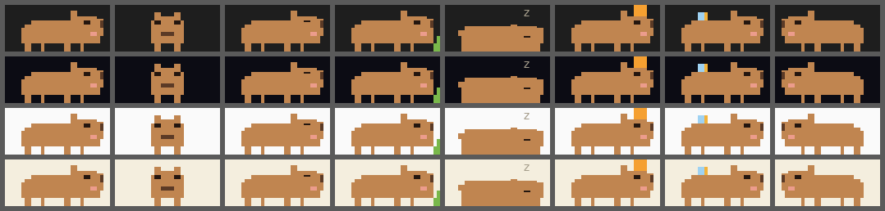

# 卡皮巴拉宠物预览（2026-10-03）

正式素材是 `assets/pets/capybara-image.toml`（图片版，55×24，41 个姿态）和 `assets/pets/capybara.toml`（方块版，35 个姿态），两版的片段名和节拍相同。下面的图和动画都直接从这两个正式包渲染，按 saddle 的规则：图片最近邻缩放、保持比例、贴地、在 16 列 × 3 行里居中；方块版按四分块、八分块逐格画。设计和取舍见 `docs/DESIGN.md`「第三只宠物：卡皮巴拉」。

预览是离线渲染的，不是终端截图：方块版里的 `z` 用 Menlo 字体画，实际终端里取决于字体；图片在真实终端里的效果要等部署后在 Ghostty 里看。

## 静态

| 内容 | 文件 |
|---|---|
| Clawd、猫、卡皮巴拉站姿并排，上图片版、下方块版，单元格 8×19 | [compare.png](卡皮巴拉宠物/compare.png) |
| 图片版 41 个姿态，源像素放大 6 倍 | [image-poses.png](卡皮巴拉宠物/image-poses.png) |
| 方块版 35 个姿态，单元格 16×38 | [blocks-poses.png](卡皮巴拉宠物/blocks-poses.png) |
| 实际大小（单元格 8×19，`tests/mascot.rs` 记的用户终端），四种深浅背景；依次是站、正脸、发呆、嚼叶子、打盹、顶橘子、小鸟，最后一列是向左时的翻转 | 图片 [image-8x19.png](卡皮巴拉宠物/image-8x19.png) · 方块 [blocks-8x19.png](卡皮巴拉宠物/blocks-8x19.png) |
| 同上，单元格 16×38 | 图片 [image-16x38.png](卡皮巴拉宠物/image-16x38.png) · 方块 [blocks-16x38.png](卡皮巴拉宠物/blocks-16x38.png) |

## 动作

按正式节拍播放（每秒 12 tick，单元格 8×19 放大 3 倍，深色背景）。走路的动画原地播放，实际运行时每 6 tick 平移一格。

| 片段 | 图片版 | 方块版 |
|---|---|---|
| 走（慢吞吞，只动腿） | [image-walking.gif](卡皮巴拉宠物/image-walking.gif) | [blocks-walking.gif](卡皮巴拉宠物/blocks-walking.gif) |
| 转身（正脸、眨眼） | [image-turning.gif](卡皮巴拉宠物/image-turning.gif) | [blocks-turning.gif](卡皮巴拉宠物/blocks-turning.gif) |
| 发呆 | [image-daze.gif](卡皮巴拉宠物/image-daze.gif) | [blocks-daze.gif](卡皮巴拉宠物/blocks-daze.gif) |
| 嚼叶子 | [image-munch.gif](卡皮巴拉宠物/image-munch.gif) | [blocks-munch.gif](卡皮巴拉宠物/blocks-munch.gif) |
| 打盹 | [image-nap.gif](卡皮巴拉宠物/image-nap.gif) | [blocks-nap.gif](卡皮巴拉宠物/blocks-nap.gif) |
| 顶橘子 | [image-orange.gif](卡皮巴拉宠物/image-orange.gif) | [blocks-orange.gif](卡皮巴拉宠物/blocks-orange.gif) |
| 小鸟落背 | [image-bird.gif](卡皮巴拉宠物/image-bird.gif) | [blocks-bird.gif](卡皮巴拉宠物/blocks-bird.gif) |

## 两版的差别

- 图片版有深棕描边、远侧腿和耳朵的深色、`ω` 形嘴、发呆时头微微低下；方块版没有描边和嘴，发呆只眯眼、抖耳朵。
- 方块版的橘子是头顶两格的橙色块，没有叶子，也没有下落和被顶走的过程（一格放不下橘子、空隙和头顶三种颜色），晃动是整格左右移；图片版的橘子带叶子，会落下、左右歪、最后被顶走。
- 方块版的小鸟是半格蓝色加四分之一格黄色的嘴，图片版有描边、眼睛和拍打的翅膀。
- 方块版里看起来一样的帧共用一个姿态（例如闭眼、发呆、满足眯眼都是 `blink`），所以姿态比图片版少，每段时长不变。

## 制作方式

像素和方块先由仓库外的临时脚本按形状生成，再看渲染结果逐步修改；预览也用仓库外的临时脚本渲染。提交的只有 toml 文本和预览图，以 toml 为准。没有使用第三方素材。
