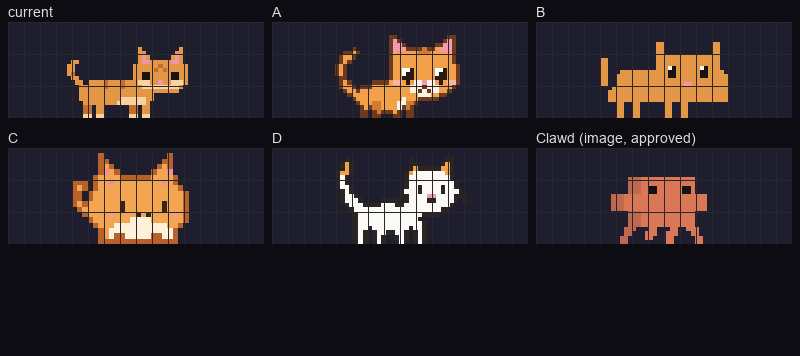
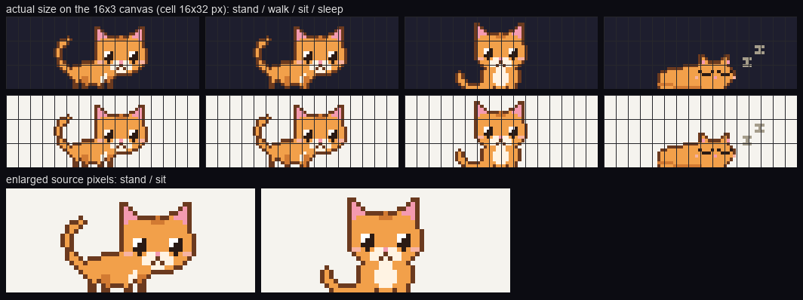
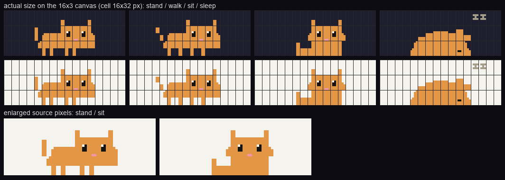
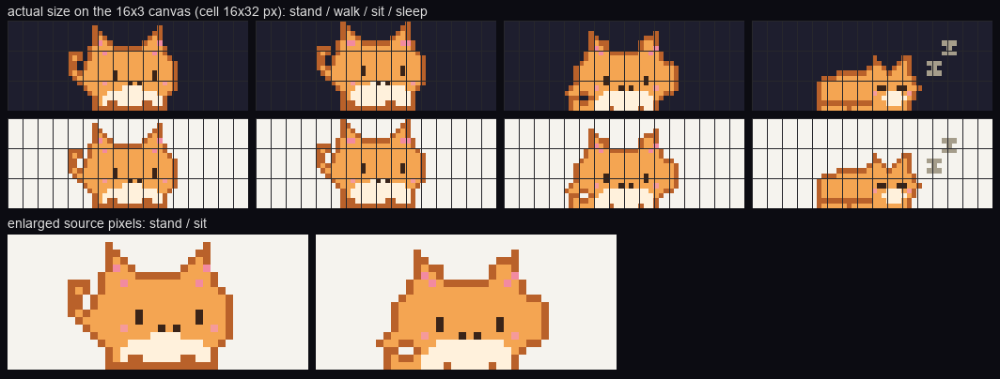
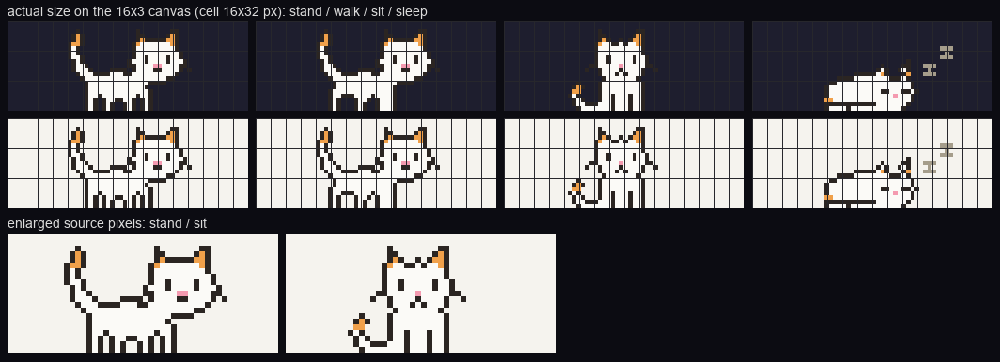

# 图片版猫猫候选调研（2026-10-03）

状态：只做了调研和概念预览，等用户选方向。生产素材（`assets/pets/cat-image.toml`）、代码和配置都没动。下文的图都是**概念预览**，每个方向只画了站、走、坐、睡四个姿态，用来比造型，不是可以直接集成的宠物包。

背景：用户满意 Blocks 猫、Blocks Clawd 和图片 Clawd，只觉得图片猫不可爱。本文只讨论图片猫，其余三套不动。

## 先说结论

- **推荐 A「描边大头」**：保留橘猫的配色和侧身走路，改成带深棕描边、圆头、带高光的大眼睛、白口鼻和短腿。它在 16×3 区域里最像“一只可爱的小猫”，现有八段动作都能照着改，而且不用改渲染器或画布。
- 想要风险最低就选 **B「方块猫高清版」**：把你已经认可的 Blocks 猫逐砖转成像素，眼睛和鼻子画得更细。造型保证不跑偏，但比起 Blocks 版几乎没有新东西。
- **C「圆团猫」**：大像素、团子身形，单看一帧最萌（审美判断），但站和坐几乎是同一个轮廓，动作之间不好区分。
- **D「线稿 Neko 风」**：白猫加细黑线，致敬经典桌面猫 Neko。它换掉了你之前选定的橘色，在深色背景上线条会隐没，所以只当风格参考列出。

需要你选一个方向（也可以说“A，但借用 C 的某一点”）。选定之后再另起任务画完整动作包。

## 怎么看预览图

所有预览都按 saddle 的实际规则绘制：最近邻缩放，保持宽高比，底边贴地，在 16 列 × 3 行里水平居中。单元格按 **16×32 物理像素**（Retina 上常见的大小）计算，即整块区域 256×96 像素。你在 Ghostty 里实际的单元格尺寸没有量过，字号不同，整体会等比例变大或变小，但胖瘦和比例不变。每张图的第一行是深色背景，第二行是浅色背景，下面是放大的源像素。走路 GIF 按 saddle 的走路节拍（每个姿态 2 tick，即 1/6 秒）循环播放。

| 对比 | 文件 |
|---|---|
| 五只猫的站姿，加图片 Clawd 作尺寸参照 | [compare.png](图片猫猫候选/compare.png) |
| 当前图片猫 | [current.png](图片猫猫候选/current.png) · [walk-current.gif](图片猫猫候选/walk-current.gif) |
| A 描边大头 | [a.png](图片猫猫候选/a.png) · [walk-a.gif](图片猫猫候选/walk-a.gif) |
| B 方块猫高清版 | [b.png](图片猫猫候选/b.png) · [walk-b.gif](图片猫猫候选/walk-b.gif) |
| C 圆团猫 | [c.png](图片猫猫候选/c.png) · [walk-c.gif](图片猫猫候选/walk-c.gif) |
| D 线稿 Neko 风 | [d.png](图片猫猫候选/d.png) · [walk-d.gif](图片猫猫候选/walk-d.gif) |

## 当前图片猫：哪里不可爱

当前素材是 55×23 像素，和 Clawd 的像素密度相同，动作和方块版一一对应（走、转身、坐、舔爪、张望、伸懒腰、玩毛线、睡）。下面把“看得到的事实”和“我的审美判断”分开写。

可观察事实（来自 `cat-image.toml` 的 stand 姿态和渲染图）：

1. 身体所占范围约 29×17 像素，实际显示约 7.6 列 × 2.2 行，23 行高度里头顶上方空着 6 行。
2. 头部是 13 像素宽的直边矩形：第 10—13 行每行都恰好 13 像素宽，没有圆角。耳朵是 1—2 像素宽的斜线。
3. 眼睛是 2×2 的纯黑方块，没有高光，两眼之间隔 5 像素，位于头部的垂直中段。
4. 额头正中、两眼上方有一个由深色条纹（`D`）组成的“M”形斑。
5. 鼻子两侧各有一块 3 像素宽的奶油色（`LLL`），和鼻子在同一行，下面一行奶油色连成一条横带。
6. 身体是约 18—24 像素长的矩形，腿是 2 像素宽、3 像素高的直柱：上段深色条纹，下段奶油色脚。
7. 没有描边。毛色 `#e29646` 和条纹 `#c0702c` 的对比不大。
8. 55×23 缩放到 256×96 的比例是 4.17，不是整数，所以 1 像素宽的耳朵、尾巴和眼睛有的被放大到 4 像素宽，有的到 5 像素，粗细不一。这一条对所有非整数比例的方案都成立。

审美判断（可能让它显得不可爱的原因，按影响大小排列）：

- **脸像在皱眉**：额头正中的深色“M”斑恰好落在两眼之间的上方，缩小后读起来像拧着的眉头，表情偏凶、偏严肃。
- **眼睛“死”**：纯黑方块没有高光，又分得很开，看起来呆滞，而不是水汪汪。可爱造型最依赖的就是大、靠下、带高光的眼睛。
- **方头**：直边矩形的头加细线耳朵，更像盒子或狐狸，不像圆滚滚的小猫头。
- **口鼻像胡子**：两侧奶油色和下面的横带连成一片，读起来像八字胡或一张很宽的嘴。
- **成年猫的比例**：长身体加细腿，腿上还有深浅两段条纹（像穿了靴子），整体比例偏成年猫甚至小狗，没有幼猫的圆和短。
- **没有描边**：Clawd 本来就是方块造型，平涂色块对它是“对的”；猫的可爱主要来自圆弧轮廓，没有描边时轮廓和内部细节都会糊在一起。

## 约束（所有候选都遵守）

- 位置、16 列 × 3 行区域、渲染器、显示方式设置都不变，不增加高度，不加新入口。
- 图片包的 `size` 可以自己定（宽高任意，渲染器保持比例缩放），所以分辨率是可以选的变量，不必固定为 55×23。
- 走路必须是整数个步态循环，换姿态和走一格落在同一个 tick；猫是 `mirror = true`，左右翻转之后不能出现错位。四个方向的脸都左右对称，翻转没有问题。
- 不能直接集成外部素材，除非许可明确允许在 saddle 里再分发（见下文「外部参考」）。

## 候选

### A 描边大头（推荐）

- 造型：保留橘色，加深棕描边（`#6b3a1f`），圆头约占全身高度的六成多，约 3×4 的大眼睛带 3 像素的白色高光，白色小口鼻配 `人` 字形嘴、腮红、粉色内耳；身体短而圆，腿短。原创绘制。风格上参考了 pixelbean 的橘猫包（描边、白口鼻、大头，见下文），但没有拷贝它的像素。
- 16×3 观感：同样 55×23 的格子里，身体约 7.8 列 × 2.6 行，比现在高出约 0.4 行，头部最显眼。坐姿用满 23 行，是四个姿态里最可爱的一张（审美判断）。
- 动作适配：现有八段都能照搬节拍重画。走路只换腿，头和身体保持不动（和 Clawd 的步态规则一致）；转身沿用正脸；张望可以挪眼珠，竖耳只剩约 2 像素的余量；舔爪、伸懒腰、玩毛线、睡觉都要按新比例重画。头大之后，伸懒腰的“前低后高”需要重新设计。
- 取舍：深棕描边在深色终端背景上会和背景融在一起，深色背景下主要靠橘色填充撑起轮廓（见预览第一行），浅色背景下描边效果最好。如果你主要用深色背景，可以把描边换成稍亮的焦糖色，这是画正式包时的细节。像素密度和 Clawd 相同，两只宠物切换时大小一致。工作量和当前猫差不多（每个姿态一张 55×23 网格）。

### B 方块猫高清版（最稳）

- 造型：把 `cat.toml`（你认可的 Blocks 猫）逐砖转成像素，每块砖 2×4 像素，得到 64×24 的图，轮廓和 Blocks 版完全一致；`▪` 眼睛画成 2×3 并加一格高光，`▁` 鼻子按八分之一格的精度画。凸角各去掉一个像素，稍微圆一点。
- 16×3 观感：64×24 正好是每个单元格 4×8 像素。当单元格尺寸是 4×8 的整数倍时（比如 16×32），缩放比例是整数，所有像素一样大，没有粗细不一的问题。这是四个方向里唯一能做到的。身体约 8 列 × 2.4 行。
- 动作适配：八段动作一一对应现成的方块姿态，可以写一个 Rust 小工具从 `cat.toml` 直接生成，几乎不用手画。
- 取舍：它和 Blocks 版长得几乎一样。选它的唯一理由是：显示方式是全局设置，你想保留图片 Clawd，又想要一只“看起来像 Blocks 猫”的图片猫。造型上不会比 Blocks 版更可爱，睡姿的阶梯状弧线也原样保留。

### C 圆团猫

- 造型：低分辨率 40×18，大像素；整只猫是一个圆团，头和身体不分，小耳朵，下半身奶油色，豆豆眼加两点小嘴，描边用深橘色而不是黑色，整体偏软。原创绘制，方向接近 16-Bit Kitty 这一类粗像素团子猫（见下文）。
- 16×3 观感：缩放比例 5.33，像素大，粗细不一的问题相对轻；身体约 7.3 列 × 2.8 行，是四个方向里最高、最“满”的。
- 动作适配：走路靠整体上下颠 1 像素加脚趾交替，读起来更像小步蹦，而不是迈腿；坐和站几乎是同一个轮廓，坐、舔爪、张望之间的区别要靠眼睛、尾巴和小道具来表现；伸懒腰要改成“拉长的团子”。
- 取舍：单看一帧最萌（审美判断），但动作表现力最弱，八段动作里有好几段会彼此很像。侧身走路的“猫感”也最弱。

### D 线稿 Neko 风（参考方向）

- 造型：48×21，白色身体加 1 像素深色线，橘色耳尖和尾巴尖，致敬 1989 年的桌面猫 Neko（oneko）。原创绘制，没有描摹 Neko 的精灵图。
- 16×3 观感：浅色背景上线稿最清楚；深色背景上线条几乎看不见，变成一只白色剪影（见预览第一行），同时 1 像素的线在非整数缩放下粗细不一最明显。
- 动作适配：Neko 的魅力在于姿态多（挠墙、打哈欠、洗脸、蜷睡），和 saddle 的“随机动作”契合；但 Neko 原图是 32×32 的竖向构图，放进 3 行高度会很小，必须重画成横向。
- 取舍：换掉了你之前在灰、橘、奶牛三种里选定的橘色（当时奶牛猫因为深浅两块总有一块融进背景而被否决，白猫加黑线有类似风险）。只在你想要“完全换个风格”时才建议考虑。

## 外部参考（已实际打开核对）

这些只用作风格参考，**都不能当作可直接集成的素材**。saddle 仓库目前没有 LICENSE 文件，是否公开发布和以什么许可发布也没有定，所以任何“可以再分发”的判断都要等这件事定下来。

| 参考 | 来源页面 | 实际看过什么 | 使用条件（按页面原文） | 和候选的关系 |
|---|---|---|---|---|
| Cat Pixel Animations Pack，pixelbean | <https://pixelbean.itch.io/cat-pixel-animations-pack> | 两张预览 GIF 的帧：橘色虎斑猫，深色描边、白口鼻、大头，32×32 网格 | 页面写“✅Credits to pixelbean. ✅Use the assets on personal or commercial projects. ❌Resell these asset packs.”；免费版 3 段动作（Idle、Jump、Walk），完整版 11 段，页面标价 $0.75（原价 $5）。能否放进开源仓库再分发：**未知**。本轮不购买 | A 的风格参考 |
| oneko.js 的 `oneko.gif`，adryd325 | <https://github.com/adryd325/oneko.js> | 256×128 精灵表，32×32 一格，共 32 个姿态（坐、睡、挠、洗脸、八方向跑） | 仓库 LICENSE 是 MIT（© 2022 adryd）。精灵图源自 Neko，英文维基百科写道 “The NekoDA sprites made by Gotoh and the code of many of its following ports are free to use, modify, and redistribute.”（<https://en.wikipedia.org/wiki/Neko_(software)>）。这张 gif 的具体出处链没有逐一核实 | D 的风格参考；姿态清单可参考 |
| Cat sprites，Shepardskin | <https://opengameart.org/content/cat-sprites> | 预览 GIF：深灰黑猫、绿眼，成年猫比例，只有走和跑 | CC0，页面写“No attribution necessary” | 许可最宽，但造型偏写实，没有坐和睡，**未列为候选** |
| 16-Bit Kitty - FREE，Maze.Bit.Boutique | <https://mxmaze.itch.io/16-bit-kitty-free> | 页面上的 100×100 预览 GIF（9 帧）：棕色虎斑团子猫，从站到坐到趴睡 | 页面写“Creative Commons Attribution v4.0 International”（CC BY 4.0，需要署名）；16×16，含 idle、walk、sit、sleep。没有下载精灵表本身 | C 的风格参考 |

查过但没有采用的：ToffeeCraft “Retro Cats” 免费版只限个人使用、不得再分发；Pop Shop Packs 要求署名且不得作为素材再分发。两者都只看了搜索摘要，没有打开预览，所以不在上表。

## 概念预览和最终动画包的区别

- 预览只有四个姿态（站、走一帧、坐、睡），没有眨眼、竖耳、甩尾、舔爪、伸懒腰、毛线和转身，也没有核对节拍。
- 预览是用临时脚本按形状生成的像素网格，只为看造型。脚本放在仓库外，没有提交（项目约定仓库里不放 Python 脚本）。正式包要按选定的方向逐姿态手工修，写成 `cat-image.toml` 的格式，并通过 `src/mascot.rs` 的内置包测试。
- 预览单元格尺寸是假设值（16×32）。正式实现前，最好在你的 Ghostty 里实际看一眼。

## 需要你选的

1. 方向：A / B / C / D，或者组合（比如“A 的脸 + C 的低分辨率大像素”）。
2. 如果选 A：主要在深色还是浅色背景下用？这决定描边用深棕还是更亮的焦糖色。
3. 是否保留现在八段动作的清单和节拍（默认保留），还是借这次机会换掉某些动作（比如 Neko 式的挠、打哈欠）。
